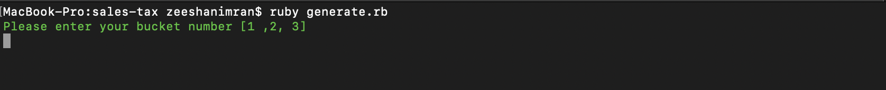
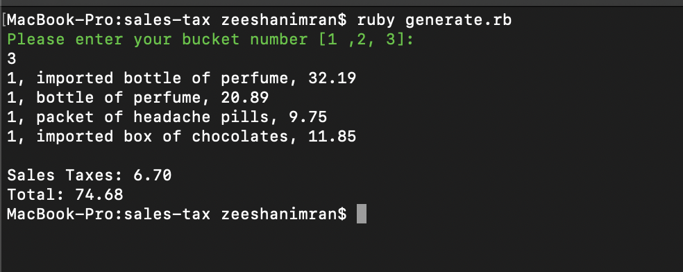
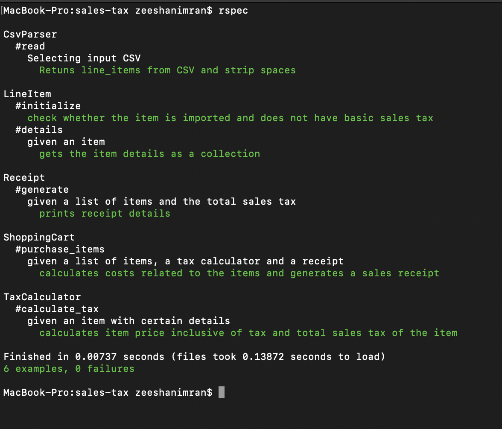

# [SALES TAXES TEST](https://gist.github.com/longkt90/896730250647868778d0) 

## Usage

This Test is related to the above linked problem. 

### Dependencies
* Ruby 2.6.3

### Test the output
Please use the following command to run

`ruby generate.rb`

*Example:*

`ruby generate.rb`

You'll see a prompt which would ask you to enter the number of input given in above problem



### Program Output
* Below is an output if you choose 3 after `ruby generate.rb`

```
1, imported bottle of perfume, 32.19
1, bottle of perfume, 20.89
1, packet of headache pills, 9.75
1, imported box of chocolates, 11.85

Sales Taxes: 6.70
Total: 74.68
```




### Running the tests
* To run test cases please use `rspec` command. below is the output image


